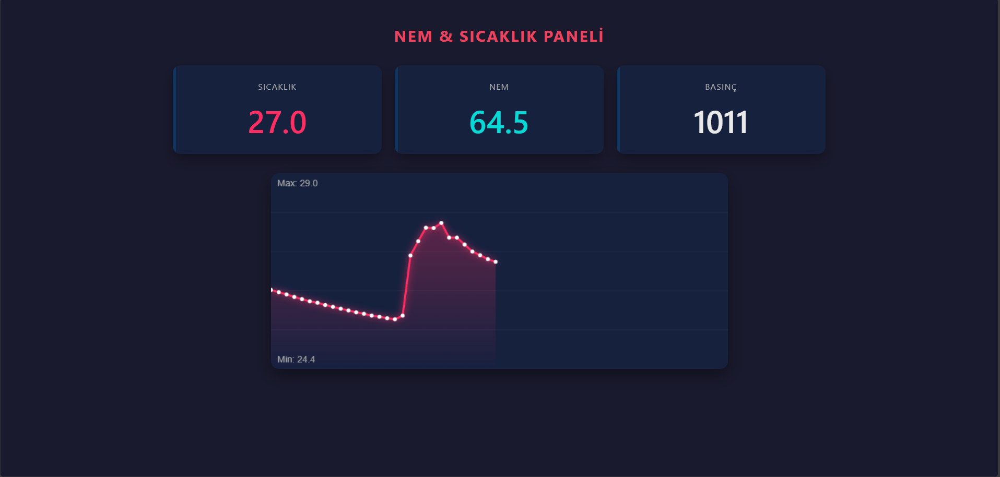
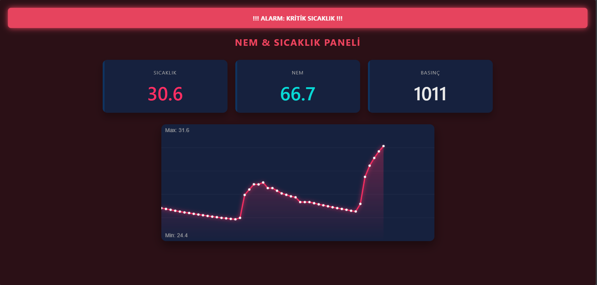
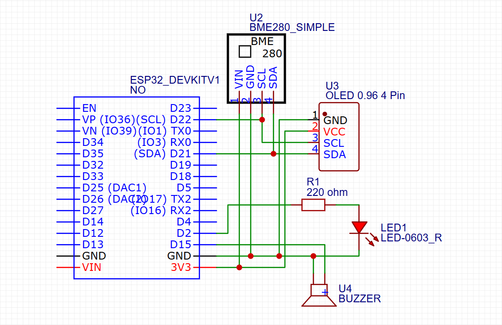

# 🌡️ ESP32 IoT Weather Station & Web Dashboard


## 📖 Overview

This project is a standalone **IoT Environmental Monitor** powered by an **ESP32**. Unlike standard examples, this system operates entirely **offline** by creating its own WiFi Access Point (SoftAP). It serves a high-performance, real-time web dashboard to visualize temperature, humidity, and pressure data using a custom-built JavaScript engine.

The firmware is designed with a **non-blocking architecture**, ensuring that sensor polling, alarm handling, and the web server operate concurrently without system freezes.

## ✨ Key Features

* **⚡ Non-Blocking Multitasking:** Utilizes `millis()` based scheduling instead of `delay()`, allowing the ESP32 to handle web requests while simultaneously monitoring sensors.
* **📊 Custom Offline Charting:** A lightweight, pure JavaScript (Canvas API) charting engine written from scratch. No external libraries (like Chart.js) or internet connection required.
* **🚨 Smart Alarm System:** Triggers visual (LED) and audio (Buzzer) alerts when temperature exceeds critical thresholds.
* **🛡️ Fault Tolerance:** Implements robust error handling for the BME280 sensor to auto-recover from hardware connection failures.
* **📱 Responsive Design:** A modern, dark-mode UI that adapts to mobile and desktop screens.

## 📸 Dashboard Interface

The web interface updates dynamically via AJAX. It features a reactive background that changes color to alert the user during critical states.

| ✅ Normal Monitoring | 🚨 Critical Alarm Mode |
| :---: | :---: |
|  |  |
| *Standard dark mode with real-time graph* | *Visual alert system active (Background Pulse)* |

## 🛠️ Hardware Requirements

* **Microcontroller:** ESP32 Development Board (DOIT DEVKIT V1 or similar)
* **Sensors:** BME280 (Temperature, Humidity, Pressure) - *I2C Interface*
* **Display:** 0.96" SSD1306 OLED - *I2C Interface*
* **Actuators:**
    * 1x Active Buzzer (5V/3.3V)
    * 1x Status LED (Red/Blue)
* **Components:** 1x 220Ω Resistor (for LED protection)

## 🔌 Circuit Diagram & Pinout



| Component | ESP32 Pin | Protocol | Notes |
| :--- | :--- | :--- | :--- |
| **BME280 SDA** | GPIO 21 | I2C | Parallel with OLED |
| **BME280 SCL** | GPIO 22 | I2C | Parallel with OLED |
| **OLED SDA** | GPIO 21 | I2C | Address: 0x3C |
| **OLED SCL** | GPIO 22 | I2C | - |
| **Status LED** | GPIO 2 | Digital Out | Needs Resistor |
| **Buzzer** | GPIO 15 | Digital Out | Active High |

## 🚀 Installation & Usage

1.  **Clone the Repository:**
    ```bash
    git clone https://github.com/mVefa/ESP32-IoT-Weather-Station.git
    ```
2.  **Install Libraries (Arduino IDE):**
    * `Adafruit BME280 Library`
    * `Adafruit SSD1306`
    * `Adafruit GFX Library`
3.  **Upload Firmware:**
    * Select your board (e.g., *DOIT ESP32 DEVKIT V1*).
    * Compile and upload `ESP32_IoT_Weather.ino`.
4.  **Connect to Dashboard:**
    * Connect your phone/PC to the WiFi network: **`IoT_Weather_Station`**
    * Password: **`12345678`**
    * Open your browser and navigate to: **`http://192.168.4.1`**

## 🔮 Future Work (Roadmap)

This project serves as a foundational layer for Edge AI applications. Future iterations aim to integrate:

* **Time-Series Logging:** Storing historical data on an SD card or transmitting it to a cloud database (Firebase/AWS IoT).
* **Edge AI / Anomaly Detection:** Implementing **TensorFlow Lite for Microcontrollers** to predict temperature spikes or detect sensor anomalies before they trigger hard limits.
* **Power Optimization:** Implementing Deep Sleep modes for battery-powered field operation.

## 👨‍💻 Author

**Muhammet Vefa Yoksul**
* *Computer Engineering Student*
* *Interests: IoT, Embedded Systems, Artificial Intelligence & Data Science.*

---
*Built with ❤️ using ESP32 & C++*